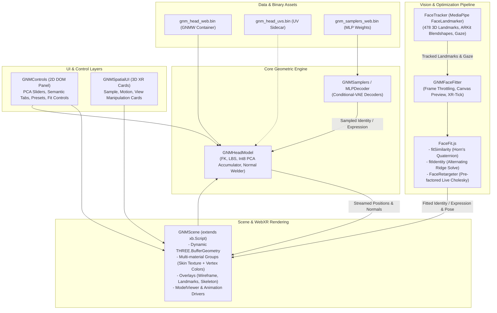
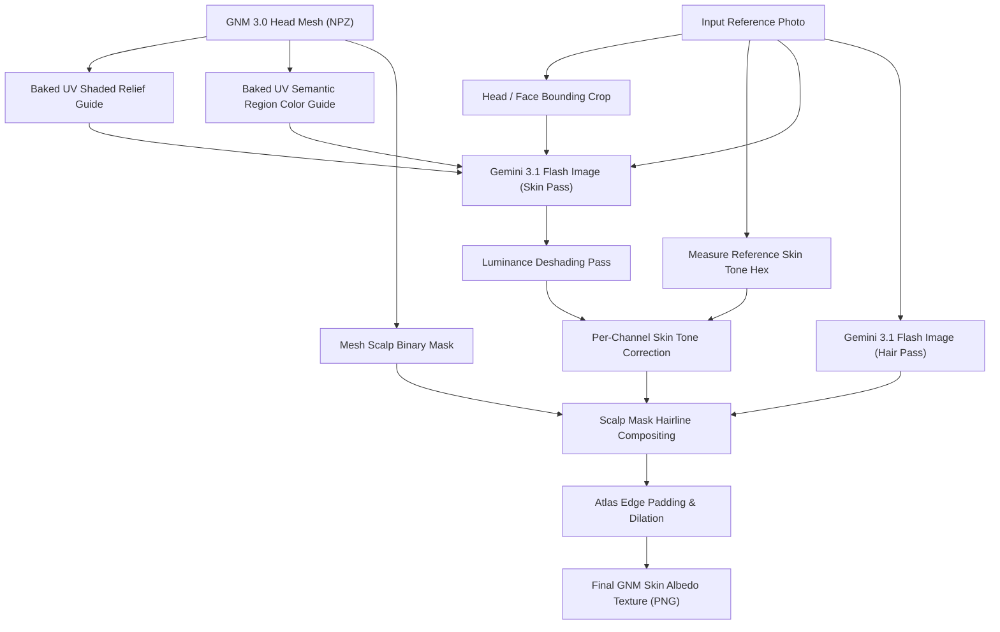

# GNM XR Blocks Demo

- **Live demo:** https://xrblocks.github.io/docs/samples/GNM-Head/
- **Recording:** https://www.youtube.com/watch?v=bOFyFlFIcdU

This demo leverages the **XR Blocks SDK** to render, animate, fit, and interact with the [Generative aNthropometric Model (GNM)](https://github.com/google/GNM) 3D head model across desktop, mobile, and Android XR headsets.

---

## Table of Contents

1. [Architecture Overview](#architecture-overview)
2. [Data Formats & Container Pipeline](#data-formats--container-pipeline)
3. [Mathematical & Algorithmic Foundations](#mathematical--algorithmic-foundations)
   - [Linear Anthropometric Forward Pipeline (FK + LBS)](#1-linear-anthropometric-forward-pipeline-fk--lbs)
   - [Conditional-VAE Semantic Sampling](#2-conditional-vae-semantic-sampling)
   - [Differential Landmark Registration & Pose Solver](#3-differential-landmark-registration--pose-solver)
   - [Closed-Form Similarity Fit (Horn's Method)](#4-closed-form-similarity-fit-horns-method)
   - [Ridge-Regularized Shape & Expression Inversion](#5-ridge-regularized-shape--expression-inversion)
   - [Real-Time Retargeting & Conditioning Budget](#6-real-time-retargeting--conditioning-budget)
   - [Seam Normal Welding & Dynamic Topologies](#7-seam-normal-welding--dynamic-topologies)
4. [Texture Synthesis Pipeline (Nano Banana 2)](#texture-synthesis-pipeline-nano-banana-2)
5. [Textured Heads & Asset Sidecars](#textured-heads--asset-sidecars)
6. [Spatial UI & WebXR Integration](#spatial-ui--webxr-integration)
7. [Credits & References](#credits--references)

---

## Architecture Overview

The application is structured into decoupled modules separating core geometric computation, machine learning inference, real-time optimization, WebXR presentation, and user interface:



### Module Responsibilities

- **`GNMModel.js` (`GNMHeadModel`)**: Dependency-free (typed arrays only) JavaScript implementation of the GNM forward kinematics and linear blend skinning model. Handles int8-quantized PCA decompression with component-wise scale folding, incremental displacement caching, Rodrigues' rotation matrices, skeletal forward kinematics, and seam normal welding.
- **`SemanticSampler.js` (`GNMSamplers`, `MLPDecoder`)**: Client-side conditional-VAE decoders mapping latent noise and demographic/emotional condition vectors to full identity (253 dims) and expression (383 dims) vectors.
- **`FaceFit.js` & `FaceCorrespondence.js`**: Pure mathematical solver containing closed-form similarity alignment (Horn's quaternion method via cyclic Jacobi rotations), Cholesky decomposition, differential identity inversion against landmarker reference shapes, and live expression retargeting.
- **`FaceTracking.js` (`FaceTracker`)**: WebAssembly/GPU wrapper over MediaPipe `@mediapipe/tasks-vision` FaceLandmarker extracting 478 3D landmarks, 52 ARKit blendshapes, and normalized eye gaze ratios.
- **`GNMFaceFitter.js`**: High-level fitting orchestrator that lazily downloads ML models, handles image bitmap decoding and webcam frame queues, and ticks during WebXR render loops without relying on window `requestAnimationFrame`.
- **`GNMScene.js`**: WebXR entity extending `xb.Script` and wrapping Three.js `BufferGeometry`, multi-material passes, turntable/idle sway animations, model anchors, and skeletal visualizers.
- **`GNMSpatialUI.js`**: Immersive 3D UI cards (`xb.UICard`, `xb.UIPanel`) rendered directly in the spatial XR environment with translation manipulation handles.
- **`GNMControls.js` & `GNMPresets.js`**: Responsive DOM HUD with grouped parameter sliders, preset JSON import/export, and local storage serialization.

---

## Data Formats & Container Pipeline

The model weights and samplers are packaged into a custom binary container format (**`GNMW`**) designed for zero-copy typed-array consumption in the browser.

```
+-------------------------------------------------------------+
| GNMW Binary Header                                          |
| - Magic: 0x474e4d57 ('GNMW') [4 bytes]                      |
| - Version: 0x00000001 (uint32) [4 bytes]                    |
| - JSON Header Length L (uint32) [4 bytes]                   |
| - JSON Descriptor String [L bytes]                          |
|   {                                                         |
|     "meta": { numVertices, numJoints, identityDim, ... },   |
|     "sections": [                                           |
|       { "name": "template", "dtype": "float32", "offset": 0, "byteLength": ... },
|       { "name": "identity_basis", "dtype": "int8", ... },   |
|       ...                                                   |
|     ]                                                       |
|   }                                                         |
+-------------------------------------------------------------+
| Raw Contiguous Payload Data                                 |
| (Directly sliced as Float32Array, Int8Array, Uint16Array)   |
+-------------------------------------------------------------+
```

### Quantization Strategy

To keep container downloads small (~35 MB for complete head geometry, skeleton, joint bases, and 636 PCA basis vectors over 17,821 vertices):

- The massive 3D shape bases ($\mathbf{B}_{\text{id}} \in \mathbb{R}^{253 \times (3V)}$ and $\mathbf{B}_{\text{expr}} \in \mathbb{R}^{383 \times (3V)}$) are stored as **int8** arrays.
- Each basis component $k$ has an associated **float32 scale** $s_k$.
- When accumulating displacements, the scalar parameter coefficient $c_k$ is multiplied with $s_k$ prior to inner-loop multiplication:
  $$\Delta \mathbf{v}_k = (c_k \cdot s_k) \cdot \mathbf{B}_{\text{int8}}[k]$$
  This eliminates the need to unpack or dequantize the multimillion-element basis in memory.

---

## Mathematical & Algorithmic Foundations

### 1. Linear Anthropometric Forward Pipeline (FK + LBS)

Given identity coefficients $\mathbf{c}_{\text{id}} \in \mathbb{R}^{D_{\text{id}}}$ and expression coefficients $\mathbf{c}_{\text{expr}} \in \mathbb{R}^{D_{\text{expr}}}$:

1. **Bind Vertex Position Evaluation:**
   $$\mathbf{v}_{\text{bind}} = \mathbf{v}_{\text{template}} + \sum_{i=1}^{D_{\text{id}}} c_{\text{id}, i} s_{\text{id}, i} \mathbf{B}_{\text{id}, i} + \sum_{j=1}^{D_{\text{expr}}} c_{\text{expr}, j} s_{\text{expr}, j} \mathbf{B}_{\text{expr}, j}$$

2. **Bind Joint Position Evaluation:**
   $$\mathbf{j}_{\text{bind}, k} = \mathbf{j}_{\text{template}, k} + \sum_{i=1}^{D_{\text{id}}} c_{\text{id}, i} \mathbf{J}_{\text{id}, i, k}$$

3. **Forward Kinematics (FK):**
   For joint $k$ with axis-angle rotation $\boldsymbol{\theta}_k = (\theta_x, \theta_y, \theta_z)^T$:
   - Local rotation matrix $\mathbf{R}_{\text{local}, k}$ is computed via **Rodrigues' Formula**:
     $$\mathbf{R}_{\text{local}, k} = \mathbf{I} + \sin(\theta)\mathbf{K} + (1 - \cos(\theta))\mathbf{K}^2 \quad \text{where } \mathbf{K} = \begin{bmatrix} 0 & -a_z & a_y \\ a_z & 0 & -a_x \\ -a_y & a_x & 0 \end{bmatrix}, \, \mathbf{a} = \frac{\boldsymbol{\theta}}{\|\boldsymbol{\theta}\|}$$
   - World transformations are computed hierarchically along kinematic parent chains:
     $$\mathbf{R}_{\text{world}, k} = \begin{cases} \mathbf{R}_{\text{local}, 0} & k = 0 \\ \mathbf{R}_{\text{world}, p(k)} \mathbf{R}_{\text{local}, k} & k > 0 \end{cases}$$
     $$\mathbf{t}_{\text{world}, k} = \begin{cases} \mathbf{j}_{\text{bind}, 0} + \mathbf{t}_{\text{root}} & k = 0 \\ \mathbf{R}_{\text{world}, p(k)} (\mathbf{j}_{\text{bind}, k} - \mathbf{j}_{\text{bind}, p(k)}) + \mathbf{t}_{\text{world}, p(k)} & k > 0 \end{cases}$$

4. **Linear Blend Skinning (LBS):**
   The joint skinning transform matrix translation is given by:
   $$\mathbf{T}_{k}^{\text{skin}} = \mathbf{t}_{\text{world}, k} - \mathbf{R}_{\text{world}, k} \mathbf{j}_{\text{bind}, k}$$
   Each vertex $\mathbf{v}$ with skinning weights $w_{k, v}$ is evaluated as:
   $$\mathbf{v}_{\text{world}} = \sum_{k=0}^{J-1} w_{k, v} \left( \mathbf{R}_{\text{world}, k} \mathbf{v}_{\text{bind}} + \mathbf{T}_{k}^{\text{skin}} \right)$$

#### Optimized Incremental Updates and Linearity Exploits

- **Incremental Slider Updates:** When a single slider changes by $\Delta c_k$, only component $k$ is added into the cached displacement sum $\mathbf{S}$:
  $$\mathbf{S} \leftarrow \mathbf{S} + (\Delta c_k \cdot s_k) \mathbf{B}_k$$
  A full re-accumulation runs every 2,000 incremental edits to strictly bound float32 numerical drift.
- **Linear Parameter Blending:** Because the forward basis sum is linear:
  $$\sum \text{lerp}(\mathbf{c}_A, \mathbf{c}_B, t) = (1 - t)\mathbf{S}_A + t\mathbf{S}_B$$
  Cross-fading between face presets costs a single vector LERP over $3V$ floats per frame, rather than an expensive matrix re-accumulation.

---

### 2. Conditional-VAE Semantic Sampling

The identity and expression generators are Conditional Variational Autoencoder (C-VAE) decoders ported to client-side MLPs:

- **Identity Decoder:** Maps $[\mathbf{z} \in \mathbb{R}^{64}, \, \mathbf{w}_{\text{gender}} \in \mathbb{R}^2, \, \mathbf{w}_{\text{ethnicity}} \in \mathbb{R}^4] \longrightarrow \mathbf{c}_{\text{id}} \in \mathbb{R}^{253}$.
- **Expression Decoder:** Maps $[\mathbf{z} \in \mathbb{R}^{64}, \, \mathbf{w}_{\text{class}} \in \mathbb{R}^{20}] \longrightarrow \mathbf{c}_{\text{expr}} \in \mathbb{R}^{383}$.

Random sampling generates standard normal latents $\mathbf{z} \sim \mathcal{N}(\mathbf{0}, \sigma^2 \mathbf{I})$ via the **Box–Muller transform** driven by a deterministic Mulberry32 PRNG. Multi-class blends evaluate convex combinations of class one-hot embeddings and per-class latent noise vectors.

---

### 3. Differential Landmark Registration & Pose Solver

Fitting GNM parameters from MediaPipe FaceLandmarker faces a critical physical discrepancy: the MediaPipe model has an intrinsic structural bias of approximately **11 mm RMS in $z$-depth** relative to true metric facial anatomy. Fitting raw landmarks against GNM template mesh vertices forces this constant offset into identity parameters, producing an unnaturally deep skull.

**The Differential Fit Solution:**
Landmarks $\mathbf{x}_{\text{obs}}$ are compared against where the landmarker places points on the GNM neutral reference face ($\mathbf{x}_{\text{ref}}$) rather than template mesh vertices:
$$\Delta \mathbf{x} = \mathbf{x}_{\text{obs}} - \mathbf{x}_{\text{ref}}$$
The constant detector bias cancels out completely in the difference.

---

### 4. Closed-Form Similarity Fit (Horn's Method)

To register observed 3D points $\mathbf{P} = \{\mathbf{p}_i\}$ to target model points $\mathbf{Q} = \{\mathbf{q}_i\}$:

1. **Centering:** Compute centroids $\bar{\mathbf{p}}, \bar{\mathbf{q}}$ and centered point sets $\mathbf{a}_i = \mathbf{p}_i - \bar{\mathbf{p}}$, $\mathbf{b}_i = \mathbf{q}_i - \bar{\mathbf{q}}$.
2. **Cross-Covariance Matrix:**
   $$\mathbf{M} = \sum_{i=1}^N \mathbf{a}_i \mathbf{b}_i^T = \begin{bmatrix} S_{xx} & S_{xy} & S_{xz} \\ S_{yx} & S_{yy} & S_{yz} \\ S_{zx} & S_{zy} & S_{zz} \end{bmatrix}$$
3. **Hamiltonian Quaternion Matrix Formulation:**
   Construct symmetric $4 \times 4$ matrix $\mathbf{N}$:
   $$
   \mathbf{N} = \begin{bmatrix}
   S_{xx}+S_{yy}+S_{zz} & S_{yz}-S_{zy} & S_{zx}-S_{xz} & S_{xy}-S_{yx} \\
   S_{yz}-S_{zy} & S_{xx}-S_{yy}-S_{zz} & S_{xy}+S_{yx} & S_{zx}+S_{xz} \\
   S_{zx}-S_{xz} & S_{xy}+S_{yx} & -S_{xx}+S_{yy}-S_{zz} & S_{yz}+S_{zy} \\
   S_{xy}-S_{yx} & S_{zx}+S_{xz} & S_{yz}+S_{zy} & -S_{xx}-S_{yy}+S_{zz}
   \end{bmatrix}
   $$
4. **Jacobi Eigen-Decomposition:**
   Solve $\mathbf{N} \mathbf{q} = \lambda \mathbf{q}$ using cyclic Jacobi plane rotations. The eigenvector $\mathbf{q}_{\max} = (q_w, q_x, q_y, q_z)^T$ corresponding to the largest positive eigenvalue is the optimal unit rotation quaternion, converted directly to rotation matrix $\mathbf{R}$.
5. **Scale and Translation:**
   $$s = \frac{\sum_{i=1}^N \mathbf{b}_i \cdot (\mathbf{R} \mathbf{a}_i)}{\sum_{i=1}^N \|\mathbf{a}_i\|^2}, \quad \mathbf{t} = \bar{\mathbf{q}} - s \mathbf{R} \bar{\mathbf{p}}$$

---

### 5. Ridge-Regularized Shape & Expression Inversion

Given aligned landmarks $\mathbf{x}_{\text{aligned}}$, the residual displacement $\mathbf{y} = \mathbf{x}_{\text{aligned}} - \mathbf{x}_{\text{ref}}$ is projected onto the GNM sub-basis $\mathbf{A} = \mathbf{B}|_{\text{landmarks}} \in \mathbb{R}^{(3N) \times K}$ through regularized weighted least squares:

$$(\mathbf{A}^T \mathbf{W} \mathbf{A} + \lambda \mathbf{I}) \mathbf{c} = \mathbf{A}^T \mathbf{W} \mathbf{y}$$

- **Depth Damping:** Since monocular camera $z$-depth is noisier than lateral $(x, y)$ tracking, diagonal weight matrix $\mathbf{W}$ sets $w_x = 1.0, w_y = 1.0, w_z = 0.10$.
- **Adaptive Ridge Regularizer:** $\lambda = \frac{\gamma \cdot \text{Tr}(\mathbf{A}^T \mathbf{W} \mathbf{A})}{K}$ where $\gamma_{\text{identity}} = 0.06$ and $\gamma_{\text{retarget}} = 0.02$.
- **Fast Solution:** Solved via **Cholesky decomposition** ($\mathbf{L} \mathbf{L}^T \mathbf{c} = \mathbf{b}$) with forward and backward substitution.

#### Alternating Optimization for Identity (`fitIdentity`)

Single still photos use an alternating optimization:

1. Initialize $\mathbf{c}_{\text{id}} = \mathbf{0}$.
2. Evaluate current shape $\mathbf{S}(\mathbf{c}_{\text{id}})$.
3. Solve similarity transform $(\mathbf{R}, \mathbf{t}, s)$ registering observed landmarks to $\mathbf{S}(\mathbf{c}_{\text{id}})$.
4. Transform observed landmarks into model coordinates.
5. Solve regularized identity displacement coefficients $\mathbf{c}_{\text{id}}$ over the **166 skull-fixed rigid landmarks** (preventing smiling or mouth shapes from corrupting skull shape).
6. Repeat for 4 iterations (converges to $< 1.8\text{ mm}$ whole-mesh RMS).

---

### 6. Real-Time Retargeting & Conditioning Budget

During continuous webcam tracking:

- **Fixed Identity:** Subject identity is locked so individual face geometry is not misinterpreted as permanent facial expressions.
- **Skull-Fixed Alignment:** Global head pose $(\mathbf{R}_{\text{head}}, \mathbf{t}_{\text{head}})$ is derived purely from similarity alignment on rigid skull landmarks.
- **Conditioning Budget:** Solving all 150 lower-face PCA components against sparse, noisy landmarks causes ill-conditioned fits that invert mouth aperture. Capping to leading components produces robust tracking:
  - `lower_face_region`: 4 components (with $1.35\times$ gain to correct landmark under-aperture).
  - `left_eye_region` / `right_eye_region`: 8 components each.
  - `tongue` / `pupils`: 0 components (unobservable from face tracker).
- **Temporal Smoothing:** Exponential moving average $\mathbf{c}_t = \alpha \mathbf{c}_{\text{target}} + (1 - \alpha)\mathbf{c}_{t-1}$ with $\alpha = 0.55$.
- **Pre-Factored Matrix:** Because landmark weights and basis columns are static per subject, $\mathbf{A}^T \mathbf{W} \mathbf{A} + \lambda \mathbf{I}$ is factored **once** upon identity acquisition; each incoming video frame costs only a right-hand-side dot product and Cholesky back-substitution ($\sim 0.1\text{ ms}$).

---

### 7. Seam Normal Welding & Dynamic Topologies

To permit full UV texture mapping, vertices lying on UV seams must be duplicated so each copy can hold distinct texture coordinates $(u, v)$. For the GNM v3.0 head:

- Mesh model contains **17,821** physical vertices.
- Texture mapping introduces **616** duplicate seam vertices, creating **18,437** render vertices.

```
Vertex v_i (Model space) ──┬──> Render Vertex v_i   (UV island A, Face Group 1)
                           └──> Render Vertex v_split (UV island B, Face Group 2)
```

#### Seam Normal Discontinuity & Welding Algorithm

Standard Three.js normal generation averages face normals per _render_ vertex index. Consequently, duplicated seam vertices only average faces on their side of the UV island, resulting in distinct normal vectors across shared edges and creating an artificial dark crease down the mesh (e.g. at the back of the head).

`GNMHeadModel.weldSeamNormals(normals)` resolves this:

1. **Accumulation:**
   $$\mathbf{N}_{\text{source}[v]} \leftarrow \mathbf{N}_{\text{source}[v]} + \mathbf{N}_{v} \quad \forall v \in [V_{\text{model}}, V_{\text{render}})$$
2. **Renormalization & Broadcast:**
   $$\hat{\mathbf{N}} = \frac{\mathbf{N}_{\text{source}[v]}}{\|\mathbf{N}_{\text{source}[v]}\|}, \quad \mathbf{N}_{\text{source}[v]} \leftarrow \hat{\mathbf{N}}, \quad \mathbf{N}_{v} \leftarrow \hat{\mathbf{N}}$$
   This guarantees $C^1$ smooth surface shading across all texture seams.

---

## Texture Synthesis Pipeline (Nano Banana 2)

The companion Python utility ([`tools/gnm_texture_from_photo.py`](https://github.com/xrblocks/assets-gnm/blob/main/tools/gnm_texture_from_photo.py)) paints complete GNM skin albedo maps from a reference photo using Gemini 3.1 Flash Image ("Nano Banana 2"):



### Key Technical Challenges Solved

1. **UV Coordinate Guidance:** GNM allocates a single $0..1$ UV square to the entire skin component (face, ears, neck, scalp). Shaded relief and semantic region color maps provide exact geometric anchors to the image model.
2. **Hairline Drift & Mask Compositing:** Image generation models frequently misplace the hairline on flat UV atlases, rendering avatars bald. The tool generates skin and hair as two distinct passes, compositing hair through a mesh-derived scalp mask with configurable `--hairline` and `--temple_drop` parameters.
3. **Tone Target Calibration:** The image model tends to pull skin complexions toward a generic pinkish tone. Reference skin tone is measured from lit areas, quoted into the prompt as hex targets, and enforced via per-channel histogram matching (`--tone`).
4. **Deshading:** Painted portraits bake directional key lights into the texture. High-radius Gaussian division (`--deshade`) removes low-frequency lighting gradients while preserving pores, craquelure, and micro-details.
5. **Linear Eye Narrowing Solve:** Mona Lisa's hooded almond eye shape is precomputed by finding the gradient of eye aperture across eye-region PCA components and serialized alongside the texture as `_pose.json` (`--eye_narrow`).

---

## Textured Heads & Asset Sidecars

- **Mona Lisa Integration:** In **View → Material**, selecting **Mona Lisa** fetches the skin texture, applies the UV sidecar, and runs an automated geometric fit against the 960px C2RMF scan.
- **UV Sidecar Architecture:** The primary model binary (`gnm_head_web.bin`, 35 MB) is decoupled from texture coordinates. The lightweight sidecar (`gnm_head_uvs.bin`, 0.4 MB) provides UV mappings and seam split index tables on-demand.
- **Dual-Group Rendering:** The texture covers the skin component only; eyes, teeth, gums, and tongue maintain high-precision per-vertex colors rendered via sub-geometry index groups.

To generate and test local assets:

```bash
# Export web binaries from GNM source weights
python tools/export_gnm_web.py --out_dir=samples/avatar_lab/gnm/assets

# Synthesize Mona Lisa skin texture and eye pose
python tools/gnm_texture_from_photo.py --out=samples/avatar_lab/gnm/assets/gnm_skin_mona_lisa.png
```

Launch with local assets:

```
http://localhost:8080/samples/avatar_lab/gnm/?localAssets=1
```

---

## Spatial UI & WebXR Integration

- **ModelViewer Integration:** Anchored via `xb.ModelViewer` with customizable platform margins, ray interaction exclusion (`xb.pointerEvents = 'none'`), and pedestal rotation.
- **Spatial UI Cards:** Three floating volumetric cards (`Sample`, `Motion`, `View`) built with `xb.UICard` and flexbox-based `xb.UIPanel`. Designed with `CARD_SCALE = 0.85` and `CARD_Y_OFFSET = -0.1` so that tops of cards remain below eye level (1.5 m default).
- **XR Session Compatibility:** Face tracking, retargeting, and animation loops run inside `GNMScene.update(delta, time)` within Three.js's WebXR frame loop, ensuring seamless operation when transitioning between desktop 2D and immersive XR headset sessions.

---

## Credits & References

- **GNM Model & Paper:** [Generative aNthropometric Model (GNM)](https://github.com/google/GNM), Google Research.
- **Webcam Tracking & Optimization:** Ported and adapted from [GNM Webcam Puppet](https://github.com/edualvarado/gnm-webcam-puppet) by Eduardo Alvarado under Apache-2.0.
- **Landmark Detection & Blendshapes:** [MediaPipe FaceLandmarker](https://developers.google.com/mediapipe/solutions/vision/face_landmarker), Google.
- **XR SDK:** [XR Blocks (`xrblocks`)](https://github.com/xrblocks/xrblocks).
